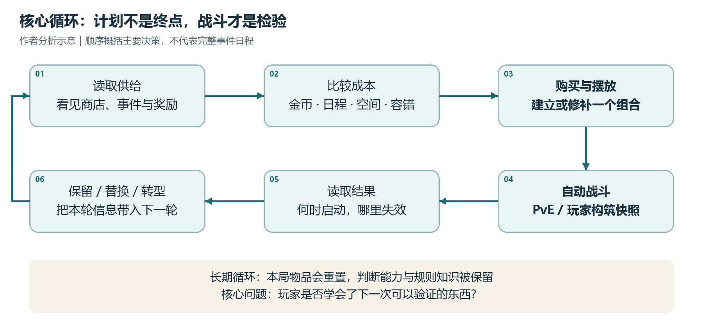
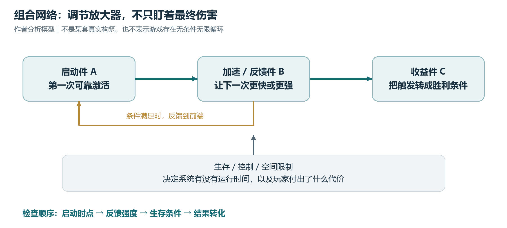

# 《大巴扎》游戏设计拆解

## 从异步构筑到风险管理：机制、体验与可迁移原则

研究对象：The Bazaar（大巴扎）｜检索截止：2026-09-26（北京时间）｜本次可核实最新正式补丁：18.3，2026-09-16

文档定位：面向游戏策划、系统设计与原型团队的桌面研究；不是通关攻略，也不是当前版本强度榜。

> 阅读说明：文中“事实”来自公开资料；“分析”是基于规则的设计推断；“建议”是待测试方案。本次未实机游玩，未取得内部埋点、收入或留存数据。旧资料只用于已标注的历史规则与设计意图，不等同于对 18.3 全部实现的逐项验证。

## 执行摘要

**核心判断：大巴扎不是“把战斗交给电脑”，而是把主要操作负担移到战前，让玩家在不断变化的供给中，设计一套能够自动运行的战斗系统。** 其官方定位包含英雄构筑、市场探索、组合发现和自主节奏；开发者也明确把异步设计与减少等待、允许玩家按自己的节奏思考联系起来。[S01][S05]

本报告形成五条设计判断：

- **深度来自机会成本，不只是物品数量。** 钱、可选事件、可用格子和剩余容错共同决定一件物品“现在值不值得买”。同一物品在不同局面下应有不同价值。
- **自动战斗把技巧重心转为系统理解。** 玩家需要判断启动速度、触发关系、成长速度与弱点；操作简单，并不等于理解成本低。
- **异步降低的是时间压力，不保证降低竞技压力。** 对手不必在线等待，但高手留下的构筑仍会进入对手池；匹配质量与失败解释仍然重要。
- **最有吸引力的组合，也是最难平衡的风险点。** 一件加速器可能提高整个网络的效率；只看单卡伤害或平均胜率，容易错过真正的问题。
- **最值得借鉴的是“发现—验证—修正”的循环。** 最不应照搬的是高内容规模、规则解释负担与持续运营成本。本报告没有证据据此判断其商业成功或失败。

建议阅读顺序：先看第 3—7 节理解玩法结构，再看第 9 节的真实补丁案例；如用于立项，直接补读第 12—13 节的迁移原则与验证方案。

## 1. 产品事实与研究边界

### 1.1 已核实的产品信息

| 项目 | 核实结果 | 依据与使用边界 |
| --- | --- | --- |
| 开发与发行 | Steam 列示为 Tempo | 不把赛事组织背景自动等同于现阶段团队规模。[S01] |
| Steam 上线 | 2025-08-13 | 这是 Steam 发售日期，不是项目首次公开、封测或公测日期。[S01] |
| 平台与语言 | Steam 页面列出 Windows、macOS 和简体中文界面 | 不据此推断移动版已经上线。[S01] |
| 类型结构 | 英雄构筑、自动战斗、Roguelike 跑局、异步对抗 | 类型标签不足以说明机制，后文按玩家决策拆解。[S01][S05] |
| 当前售卖形式 | 本次读取的美元商店页为付费本体，列有额外内容与应用内购买 | 页面价格为 19.99 美元；地区、促销和账号权益可能不同，不是购买建议。[S01] |
| 版本锚点 | 18.0：2026-09-02；18.3：2026-09-16 | 官网及官方 Steam 公告交叉核对；未发现本次检索中更晚的正式补丁。[S02][S03] |

**版本纪律：** 2024 年采访中的免费化计划、早期排位门票或旧宝箱规则，不能直接写成今天的规则。2025-09-03 的官方公告已讨论降价、匹配和内容发布方式调整；当前商店信息优先于早期愿景。[S01][S04][S05]

### 1.2 本文不做的判断

- 不把一个公开视频、一条评论或一个主播的构筑，当作总体玩家行为。
- 不给出未经实测的当前最强英雄、物品胜率、平均跑局时长或流失率。
- 不把“有付费英雄”直接等同于“付费必胜”，也不把“有免费试玩”写成完整游戏免费。
- 不把其他游戏的利息、共享卡池、合成规则，未经核实地套入大巴扎。
- 用户未提供自己的项目参数；“可迁移建议”面向同类原型，不是针对既有产品的改版结论。

## 2. 设计定位：它卖给玩家什么体验

### 2.1 核心体验不是出牌，而是“我搭出了一个系统”

【事实】官方介绍强调在市场中收集物品、布置战板、发现组合，并同时面对怪物与其他玩家的构筑。开发者在 2024 年采访中说明，异步能减少同步房间的等待，但也会损失侦察、针对性换装等互动。[S01][S05]

【分析】据此可将其体验承诺概括为：**我读懂了一些局部规则，在有限条件下组织它们，随后亲眼看到组合生效。** 购买是一种押注，摆放是一种编排，自动战斗则像一次可观察的运行结果。胜利不只来自数值更高，也来自“我的解释被验证了”。

这使它同时容纳两类需求：喜欢推导最优解的竞技玩家，以及喜欢发现奇特组合的实验型玩家。二者不总是一致：前者倾向重复稳定方案，后者希望偏门构筑也能获得反馈。这里只是设计上的目标人群假设，不是实际用户画像统计。

### 2.2 用“规则—行为—感受”对齐设计

| 规则或结构 | 预期促成的行为 | 可能形成的体验 | 必须付出的代价 |
| --- | --- | --- | --- |
| 跑局内逐步获得物品 | 根据当前供给调整计划 | 发现感、临场应变 | 随机不顺时可能被理解为无能为力 |
| 有限空间及位置关系 | 比较替换损失、优化组合 | 组合被自己组织起来的成就感 | 规则越多，读取与计算成本越高 |
| 自动执行的战斗 | 战前预测、战后复盘 | 从预期到兑现的爽感 | 战中缺乏纠错入口 |
| 异步对手 | 按自己的节奏作决定 | 自主、少等待 | 对手存在感与直接博弈减弱 |
| 一局一重建 | 在新供给中迁移旧知识 | 重玩、掌握感 | 失败后若无新认知，可能只剩重复 |

表中行为与体验均为分析推断；事实基础见产品介绍、开发者访谈与基础规则资料。[S01][S05][S06][S08]

## 3. 核心循环：把“逛市场”变成连续决策

### 3.1 一局的基本路径

【事实】基础规则资料描述：选择英雄后，沿游戏内的天数推进，经历商店或事件、PvE，再面对其他玩家留下的构筑快照；目标是取得 10 次 PvP 胜利。输掉 PvP 会减少 Prestige，本文译作“声望”。声望决定跑局容错，不是单场战斗的生命值。[S06][S07][S08]

【分析】这条循环有三个嵌套层次：

- **微观：读取—估值—买卖—摆放。** 核心问题是“这个选择比我放弃的选择好在哪里”。
- **跑局：建立临时方案—接受检验—修补或转型。** 每次战斗把纸面计划变成有成败的结果。
- **长期：学习规则—建立经验—迁移到新局。** 排位与收藏可以提供外部目标，但更耐久的资产应是玩家获得的判断能力。

这里使用三种时间尺度作为分析工具，不把它们写成实测的秒数、分钟数或留存周期。

### 3.2 日程是机会预算，不是现实倒计时

【分析】去一次商店的成本不只是金币，还包括“这次没有去拿经验、属性或另一种供给”。因此，日程让玩家不断比较：现在补强，还是投资以后；获取更广的选项，还是把现有方向做深。

这比单纯增加商店价格更有效地制造取舍：金币可以在某些情况下重新赚到，但已经选过的机会未必能重来。反过来，如果绝大多数事件总有一个明显最优选项，名义上的分支就会退化成背答案。

### 3.3 PvE 与 PvP 的不同职责

【事实】PvE 遭遇会影响收益与成长，攻略资料强调需要按当前构筑判断怪物是否适合挑战，而非只看标示难度。PvP 则检验构筑能否对抗其他玩家方案。[S06]

【分析】PvE 适合提供相对可学习的风险基准；PvP 提供不断变化的强度环境。两者混合的优势是“有规律可学，也有新题可解”。风险则是双重惩罚：误判 PvE 丢掉成长机会后，可能在下一次 PvP 再损失容错。需要验证这种连锁是否仍给玩家留下纠错空间。

## 4. 构筑系统：空间是另一种价格

### 4.1 一维战板为何仍能产生深度

【事实】公开玩法资料将物品分为小、中、大三种尺寸，分别占 1、2、3 格；战板容量会随成长扩展，常规上限为 10 格。该来源更新于 2026-03-05；本文将其作为基础结构依据，而非声称已经实测 18.3 的全部例外。[S08]

【分析】一维排列降低了几何操作负担，却没有取消空间决策。大型物品占用的不只是三格，而是三格中原本能够成立的其他组合。位置限制进一步使“单卡强度”和“能否放进当前系统”分离。

可用一个非官方的估值框架表达：

**替换价值 = 新组合的预期贡献 − 被移除组合的预期贡献 − 转型成本 − 额外失败风险。**

这里的贡献可包含输出、防御、经济、控制和未来选择权，不能简单统一为纸面 DPS。这个框架用于提问，不是游戏内部结算公式。

### 4.2 将构筑拆成五种功能，而不是一张终局清单

| 功能 | 玩家真正需要解决的问题 | 好的供给结构 | 常见失衡风险 |
| --- | --- | --- | --- |
| 启动件 | 第一轮效果如何可靠发生 | 存在较稳定的早期入口 | 只有一张关键物品能启动 |
| 加速件 | 如何增加有效触发频率 | 有收益，也有空间或条件成本 | 万能加速器适配所有构筑 |
| 收益件 | 触发最终转化为什么胜利条件 | 不同转化方向有明显差异 | 只剩一种输出路线最划算 |
| 生存件 | 如何活到系统生效 | 有可识别、可选择的针对性 | 堆生存同时无代价增强输出 |
| 过渡与转型件 | 缺组件时如何继续玩 | 可以保留部分前期投资 | 中途替换成本过高，只能硬找 |

【分析】分类是作者的阅读方法，不是游戏内官方标签。其价值在于把“我缺某一张神卡”改写为“我缺一个能履行这种功能的组件”。后者更有利于观察一套内容是否真的允许随机适应。

### 4.3 技能上限应来自情境判断

【分析】如果玩家只是记住一套最终排列，深度主要存在于外部攻略；如果玩家能解释为什么此时先买防御、为什么暂缓升级、为什么保留一件不完美的过渡物，技巧才真正存在于局内。

因此，“物品池很大”不是深度的充分证据。更有效的问题是：同一个玩家在不同金币、声望和供给条件下，是否会合理地作出不同选择？是否能通过多个局部改善继续推进，而不是一次抽中核心物品后才开始玩？

## 5. 战斗系统：时间与触发关系比平均伤害更重要

### 5.1 自动执行没有消灭战术，只是改变了发生时点

【事实】关键词资料区分了 Charge、Haste、Slow、Freeze 和 Multicast：它们分别涉及冷却推进、充能速率、停滞与多次执行；Poison 与 Shield 的交互也不同于普通直接伤害。该术语页更新于 2026-08-11。[S09]

【分析】这意味着至少要分开比较四个维度：首次启动时间、之后的循环效率、能否活到下一轮、遭到干扰后的恢复能力。强构筑不必在所有维度都领先；存在清晰短板，才能让防守与针对策略有价值。

### 5.2 一个说明“断点”的假设算例

**以下为作者构造的简化例子，不对应某张真实物品。** 假设一次激活造成 30 点伤害，首次激活发生在完整冷却结束时；不考虑暴击、护盾、加速、打断和伤害溢出，战斗持续 10 秒。

| 冷却 | 平均输出速率 | 10 秒内激活次数 | 10 秒内总伤害 |
| --- | --- | --- | --- |
| 6 秒 | 30 ÷ 6 = 5 点/秒 | 1 次 | 30 点 |
| 4 秒 | 30 ÷ 4 = 7.5 点/秒 | 2 次 | 60 点 |

【分析】平均速率增加 50%，但这个观察窗口内的伤害增加 100%。这说明冷却调整可能跨越“多打一轮”的关键边界，实际影响不应仅用线性比例估算。换一个战斗长度，结果还会改变。

### 5.3 组合网络的风险：强的不一定是终结者

【分析】若 A 更频繁地激活 B，B 又增强或加速 A，整体收益就可能呈现明显的非线性。不能仅因为网络存在反馈就称它“无限循环”：还需要检查最小间隔、触发条件、次数限制、控制与战斗结束机制。

平衡时应定位瓶颈：是启动过早、加速件过于通用、生存过强，还是最终收益倍率过高？只削弱最后造成伤害的物品，可能让同一加速器换一个收益件继续成为最优解。

## 6. 经济与声望：用有限未来给贪心定价

### 6.1 至少存在四种不同的预算

| 预算 | 作用 | 不应混淆的概念 |
| --- | --- | --- |
| 金币 | 购买、调整和利用供给的支付能力 | 有钱不等于已经有战力 |
| 日程机会 | 决定还能接触多少次成长或供给 | 无现实倒计时，不等于没有机会成本 |
| 战板空间 | 限制可同时投入战斗的功能 | 仓库能保留组件，部分战外效果仍可生效 |
| 声望 | 决定还能承担多少次 PvP 失败 | 与单场生命值、账号等级都不同 |

表为设计分析归纳；相关基础规则见跑局、战板与声望资料。[S06][S07][S08]

### 6.2 经济件真正的成本是“能否等到回本”

【分析】收益型物品的价值，不能只比较最终赚了多少钱，还应计入净投入、错过即时补强的机会和等待收益的淘汰风险。仅当收益要求上阵时，才应扣除战板占格成本；部分战外效果在仓库也能触发，不能把所有经济件统一视为挤占战板。[S06]

一个只用于解释的模型：

**净期望收益 = Σ（活到第 t 次兑现的概率 × 该次收益）− 净投入 − 放弃的战斗价值。**

如果临近淘汰，远期收益的名义数值再高，也可能不如马上补一件能保住本轮的物品。这个模型不是玩家必须计算的公式；理想设计应让玩家通过反馈逐步形成直觉。

### 6.3 声望把“贪”变成可计价的选择

【事实】2025-03-05 的声望指南描述了 20 点起始声望、PvP 失败损失与当前游戏日相关，以及特殊续命机会。本文使用这一资料解释原始容错思路；不将历史续命奖励和具体掉落视为当前保证。[S07]

【分析】失败代价随进程变重，会让前期试错相对便宜、后期选择更紧迫，也使“再给我一轮，我就启动了”成为有张力的赌注。风险是后期一次不利匹配可能终止一整局投入；越接近终局，系统越需要让玩家看懂自己为何输。

### 6.4 不要把局内经济当成长期货币经济

【分析】跑局重置能阻止金币无限跨局积累，但不能自动解决局内滚雪球。反过来，长期付费内容与局内金币也不是同一个平衡问题。讨论经济时应分别记录局内资源、账号成长与付费权益，避免用一个“通胀”概念解释全部现象。

## 7. 随机性与异步 PvP：舒适和公平并非同一件事

### 7.1 将随机拆成三个位置

| 随机发生处 | 玩家通常能做什么 | 设计价值 | 需要防范的风险 |
| --- | --- | --- | --- |
| 选择之前：商店、事件和奖励供给 | 估值、保留替代路线、换方向 | 让不同局生成不同问题 | 可行备选太少，随机变成卡关 |
| 战斗之中：随机目标等结算 | 通过构筑降低脆弱性，但难即时纠错 | 打破完全重复的结果 | 高方差结果掩盖决策质量 |
| 对手分配：遇见什么构筑 | 建立对环境的预期、适当分散风险 | 为同一构筑提供不同检验 | 极端克制或强度错配造成不公平感 |

【事实依据】供给与对战结构来自基础资料；18.3 修复了若干随机目标实现问题，说明战斗中的目标随机也必须与界面规则一致。[S02][S06] 【分析】不能笼统地说“随机越少越好”：在选择前出现的变化，往往能创造决策；在不可响应的结算末端出现的大幅变化，更需要解释和限制。

### 7.2 好随机的判据是“有没有有意义的响应”

【建议】评估随机质量时，记录玩家遇到不理想供给后是否仍有两条合理路线，而不是只统计是否抽中某张牌。应区分“偏离理想构筑但仍能推进”与“缺关键入口所以无法运行”。

可测试的改善方向包括功能替代件、过渡型组件、有限定向供给和失败后的信息反馈。这些不是对现版本已有功能的断言；它们的代价是降低稀缺感、增加系统复杂度，或让供给更容易被攻略固定化。

### 7.3 异步移除了等待，但没有移除高手

【事实】2025-09-03 的官方预告提出按玩家段位约束幽灵对手池，以改善新手体验。这证明开发团队曾把匹配视为上手体验的一部分；该历史预告不等于今天完整匹配算法的公开说明。[S04]

【分析】幽灵对手是一份历史构筑，不是一个正在针对你调整阵容的人。因此，主要博弈更接近“在不完全信息下准备一个能覆盖常见环境的方案”，而不是“观察当前对手、马上反制”。

这里还有一个统计陷阱：击败某个幽灵，不能直接推出原玩家此刻在另一端输了一局。不能未经验证就把全服战斗视为严格一胜一负的零和配对，也不能机械要求所有聚合口径的胜率恰好为 50%。

### 7.4 对手池是平衡系统的一部分

【建议】至少审计幽灵的生成版本、所在游戏日、玩家段位、快照时点和抽样权重。应测试过期强势快照、重复对手与高强度样本被过度抽中的风险。这里列的是应检查的故障模式，不是在断言大巴扎当前存在这些问题。

## 8. 体验与可读性：要让玩家看懂组合，而不只是看见特效

### 8.1 低操作门槛可能伴随高认知门槛

【分析】玩家不需要高频手速，却可能要同时理解尺寸、标签、触发对象、持续时间和叠加规则。真正困难的往往不是“读不懂一个词”，而是“读懂每个词后，仍不知道它们在时间上如何组合”。

设计上应分三层呈现：先说明单件物品的功能，再显示它对当前战板的影响，最后提供完整关键词与触发顺序。让所有细节一次性堆在新手面前，不等于信息透明。

### 8.2 反馈必须能说明因果

【事实】18.0 为 Notes 相关购买提供摆放预览；18.2 调整菜单返回入口、命名与英雄选择呈现。这些改动表明规则预览与导航成本都是官方持续处理的问题，但不能据此认定所有可用性问题已经解决。[S03]

【分析】理想的战斗反馈应回答：谁触发了谁、哪里产生了关键增益、核心组件何时失效。若只能看到最终数字，玩家可能把“起手慢”“被控制”和“对局不利”都归因为运气。

### 8.3 失败也应产生可带走的东西

【建议】结算可以优先提供三项信息：第一次关键激活的时间、主要胜负转折、一个可验证的改进方向。例如“关键物品在第二次激活前被击败”，比泛泛地说“提升伤害”更有学习价值。

不宜只推荐一套最优构筑。推荐若变成固定答案，会削弱探索；更好的方式是解释缺少哪种功能、展示多个可能的补救方向，并承认不存在保证胜利的选择。

## 9. 用真实补丁看平衡方法：18.3 案例

以下变动均来自 2026-09-16 的官方 18.3 公告；右栏是作者分析，不是开发者原话。[S02]

| 官方改动摘要 | 对应的调节手段 | 可迁移的设计启示 |
| --- | --- | --- |
| Eagle Sigil：小型改为中型 | 提高空间成本 | 保留效果特色，同时让玩家放弃更多其他组件 |
| Parachute：移除治疗效果；官方提到复杂度 | 减少职责与规则负担 | 单件物品不必同时解决所有问题；删功能也能改善设计 |
| Stompers：起始品质改为白银，并重调伤害；意图减少前期可得性、补后期 | 调整出现阶段与成长曲线 | 前期过强不一定要牺牲整个后期用途 |
| Freefall Simulator：回退此前版本；公告指出它抬高多件物品表现 | 回退系统放大器 | 先排查网络中的通用加速或放大节点，而非逐张削弱受益者 |
| Bangles：冷却从 4 改为 6 | 调节触发频率 | 应关注首次启动和关键时间窗口，不只看长时间平均值 |

【分析】这组案例说明，可用的平衡手段至少包含“数值、空间、获取时点、规则职责和网络结构”。优秀的调整不只是让强卡变弱，还应保留玩家愿意使用它的理由。

**重要限制：** 补丁理由不是效果验证。没有调整后的分层使用率、供给率、胜率和玩家反馈，不能断言这些改动已成功改善环境，也不能把“削弱某卡”当成此前必然不可玩的证据。

## 10. 商业化与内容运营：公平感包含“选择是否可及”

### 10.1 按时间理解产品变化

| 时间 | 可核实的信息 | 本文如何使用 |
| --- | --- | --- |
| 2024-12-06 | 开发者采访讨论异步设计、免费化设想和未来内容计划 | 只用来理解当时的设计意图，不作为当前权益说明。[S05] |
| 2025-08-13 | Steam 发售 | 区分平台发售与此前测试阶段。[S01] |
| 2025-09-03 | 官方预告提出本体降价、匹配调整，并区分较小平衡季与较大内容发布 | 作为历史产品调整案例，不保证此后每次都遵守原排期。[S04] |
| 2026-09 | 官方公告仍在进行赛季内容、平衡和界面调整；18.0 中 Tournament Mode 仍在测试分支 | 不把测试分支功能误写成所有正式服用户均可用。[S02][S03] |

### 10.2 付费内容如何进入设计判断

【分析】新英雄不只是一个数值单位，也可能意味着新的物品池、规则组合和知识学习对象。因此，公平感不应只比较裸面板，还要观察玩家能否接触足够多的可行策略、是否理解自己的选择边界，以及内容是否有充分的试用和学习渠道。

但由此不能直接推出付费英雄更强。本次没有控制熟练度、使用者水平、版本与对手池后的数据，不对“付费强度优势”作肯定或否定判断。

### 10.3 内容更新既增加组合，也增加成本

【分析】新标签、新触发条件和跨角色联动，会扩大设计空间，也扩大规则解释和组合验证的工作量。成本不只在美术与卡面数量，还在交互边界、测试、回放解释和版本兼容。

【建议】内容节奏应区分“修复规则一致性”“调整强度”和“增加新玩法”。如果这三类变化同时高频发生，玩家就很难判断自己是没学会，还是刚学会的规则又变了。运营稳定性是长期掌握感的一部分。

## 11. 与同类游戏对齐：相似外观不等于相同决策

对比范围限定为《Slay the Spire》初代与《Backpack Battles》的代表性基础结构，不延伸到续作或所有特殊模式。大巴扎也不是这些游戏的简单相加。

| 维度 | 大巴扎 | 杀戮尖塔（初代） | 背包乱斗 |
| --- | --- | --- | --- |
| 官方介绍的构筑载体 | 英雄、物品战板与组合 | 跑局中建立卡组并选择路线 | 购买、合成并在背包中摆放物品 |
| 主要检验对象 | 怪物与其他玩家的构筑 | 单人爬塔中的敌人与首领 | 其他玩家的物品构筑 |
| 主要空间关系 | 有限一维战板及位置关联 | 不以物品拼装战板为核心 | 不同形状与尺寸的物品排列 |
| 作者概括的决策重心 | 在市场供给与日程压力下编排自动引擎 | 构筑、路线与战斗中的出牌选择相互作用 | 购买与摆放同时优化空间收益 |
| 迁移时应问的问题 | 不理想供给出现后还能否转型 | 构筑选择如何被后续战斗验证 | 空间整理是否产生真实取舍而非纯操作负担 |

事实依据：大巴扎官方介绍与基础玩法资料；《Slay the Spire》及《Backpack Battles》官方 Steam 页面。决策重心与迁移问题为作者分析。[S01][S08][S10][S11]

【分析】最接近大巴扎的借鉴对象不是“看起来也是卡牌”的游戏，而是同样把战前构筑、空间成本和自动验证连接起来的系统。若新项目依赖即时反制、玩家间谈判或强社交协作，异步幽灵制就未必适合。

## 12. 可迁移原则与改进优先级

### 12.1 值得借鉴，但必须保留其代价

| 原则 | 为什么值得借鉴 | 适用前提 | 不应机械复制的部分 |
| --- | --- | --- | --- |
| 战前有深度，战中自动验证 | 减少执行门槛，突出组合推理 | 玩家能看懂结果与原因 | 以为取消操作就能自动获得休闲体验 |
| 把空间当作资源 | 用统一规则约束强度与功能叠加 | 摆放成本有清晰反馈 | 只增加尺寸，却不给替换选择 |
| 保留功能替代与过渡件 | 让随机成为适应题而非寻卡题 | 不同路线确有差异 | 用完全等价物消除所有取舍 |
| 让强组合有启动、空间或时间代价 | 保留爆发爽感，同时提供约束 | 代价可感知、可利用 | 每次出强组合就简单删除其玩法 |
| 把失败转化为知识 | 支撑长期掌握感 | 有可解释的因果反馈 | 只靠外部攻略填补游戏内信息空白 |
| 以可玩性验证带动内容扩张 | 控制测试与认知负担 | 原型已能产生重复游玩意愿 | 用大量新卡掩盖核心选择贫乏 |

以上均为作者建议，不是对游戏现状的客观评分。

### 12.2 如果负责类似项目，应先做什么

**P0：先证明核心选择成立。** 在没有通行证、每日任务和长期奖励时，玩家是否愿意继续尝试下一局？能否举出两个都合理但代价不同的购买方案？

**P0：建立规则一致性与解释能力。** 卡面、实际触发与战斗回放必须能互相对应。特别检查随机目标、同时触发、控制结束、替换物品和跨组件增益。

**P1：给不理想局面保留路径。** 优先补过渡件、功能性替代和有限转型机会；不要只增加极端上限。目标是让普通供给也值得作决定。

**P1：按环境而非单卡调平衡。** 联合观察获取阶段、空间、伙伴物品与对手类型，识别“看似普通但使很多组件超标”的枢纽。

**P2：再扩展社交、收藏与竞争表达。** 分享构筑、复盘和特殊比赛可能扩大长期价值，但不能替代核心循环。是否建设实时模式，应由目标人群和资源决定。

## 13. 如何验证这些判断，而不把推测写成结论

### 13.1 先提出可被推翻的假设

| 假设 | 观察或测试方式 | 什么结果会推翻它 |
| --- | --- | --- |
| 战板空间带来有意义的选择 | 记录同一局面下的备选组合及理由 | 玩家只照固定排序买卡，位置几乎不改变判断 |
| 随机供给鼓励适应而非硬找 | 记录供给、购买、转型与失败时点 | 多数失败局都在等唯一启动件，且无合理替代 |
| 自动战斗能教会玩家改进 | 战后请玩家解释败因，并做一次调整 | 多数人只能说“运气差”，或无法预测调整效果 |
| 异步让体验更舒适 | 区分主动思考、空等、挂机和恢复后的迷失 | 等待虽减少，但重返成本或决策疲劳抵消了收益 |
| 强组合具有可支付的代价 | 比较不同启动速度、容错和占格配置 | 某类加速器几乎无需牺牲即可进入所有强构筑 |

### 13.2 最小埋点清单

【建议】记录版本、英雄、游戏日、段位、金币、声望、战板、可见供给、选择、出售、关键替换、首次激活时间、对手快照版本及结果。关键是保存“当时看到什么”，不能只保存最后买了什么。

数据口径必须同时记录：

- **供给后选择率：** 看见某物品后选择它的比例，而不只是最终登场次数。
- **入场阶段：** 同一物品早买和晚买，不能混在一个平均值里。
- **组合条件：** 物品与哪些启动件、加速件共同出现。
- **对手条件：** 所在游戏日、对手类别与匹配分层。
- **失败后的学习：** 是否查看反馈，下一局是否作出与败因相关的调整。

【分析】高胜率可能因为强玩家更会使用，也可能因为只有已经领先的局面买得起；高使用率可能因为供给频繁。未控制这些条件，不能把相关性直接当成削弱依据。

### 13.3 一轮可执行的原型验证

【建议方案，不是大巴扎已有开发计划】先用 2 个机制差异明确的角色、约 30—40 件物品、几类可重复 PvE 场景和可追踪的构筑快照，验证“购买—摆放—战斗—复盘”。暂不加入付费、任务链和大量收藏。

第一轮可邀请 12—18 名不同熟练度玩家进行观察式测试；这个规模用于发现问题，不足以代表市场比例或证明留存提升。新手与资深构筑玩家分开看，不用整体平均掩盖不同体验。

测试顺序建议为：

- 先看是否能独立理解并完成一个有效组合。
- 再看供给不理想时能否选择替代路线。
- 再看失败后能否说出可验证的原因与修改方案。
- 最后看没有额外奖励时，是否仍愿意再开一局，并询问理由。

可预先设置探索性验收线，例如“首轮观察中，多数玩家能解释一次关键因果”。应在测试前明确口径，不能测试后为了通过而改标准。若要判断某改动是否提高留存或公平感，需要更大样本、置信区间和控制混杂因素的研究，本文不虚构显著性。

## 14. 总结

大巴扎最值得学习的不是某张物品卡，也不是“异步自动战斗”这个标签，而是三件事的耦合：

- **有限供给让玩家产生计划，有限资源让计划必须取舍。**
- **自动运行把组合的效果外显，让玩家体验自己建立的因果链。**
- **一局一重建让具体物品被重置，但让知识与判断留下来。**

其核心张力也来自同一结构：想让组合足够夸张，又要让竞争仍可接受；想让玩家自由实验，又要面对竞技环境对稳定最优解的追逐；想用异步减少压力，又必须处理不透明匹配与失败的归因。

**最终建议：借鉴它的决策结构，不急于复制它的内容规模。先验证玩家能否在不完美的条件下作出有趣选择，再讨论扩角色、做赛季和商业化。**

## 参考资料与证据分级

检索日统一为 2026-09-26（北京时间）。A 类为官方商店或公告；B 类为对开发者的直接采访；C 类为第三方规则资料。作者提出的模型、风险推断、优先级与测试方案，不属于来源已证实的结论。

[S01] A｜Tempo：《The Bazaar》Steam 商店页。用于开发发行、Steam 日期、平台、语言、售卖形式与产品定位。动态页面，仅代表本次读取快照。地址：`https://store.steampowered.com/app/1617400/The_Bazaar/`

[S02] A｜Tempo：Hotfix 18.3／Patch 18.3，2026-09-16。用于版本确认与第 9 节案例。官网与 Steam 官方公告交叉核实；标题存在 Hotfix／Patch 的渠道差异。地址：`https://www.playthebazaar.com/patch-notes`；`https://steamcommunity.com/app/1617400/announcements/?l=english`

[S03] A｜Tempo：Patch 18.0: Music Mayhem，2026-09-02；Hotfix 18.2，2026-09-04。用于 Notes 预览、界面改动与 Tournament Mode 测试状态。地址：`https://www.playthebazaar.com/patch-notes`；`https://steamcommunity.com/ogg/1617400/announcements/detail/717914553706349628`

[S04] A｜Tempo：Community Update: Communication and September 10th Patch Preview，2025-09-03。用于历史定价、匹配与内容发布调整；其“计划”不自动等同于当前完整规则。地址：`https://steamcommunity.com/games/1617400/announcements/detail/527605125677581053`

[S05] B｜Ian McBride / Noisy Pixel：Reynad Talks The Bazaar – 6 Years in the Making, Asynchronous PvP, and the Future of Deckbuilding，2024-12-06。用于异步设计意图和历史计划；不沿用已过时商业承诺。地址：`https://noisypixel.net/the-bazaar-interview-reynad-asynchronous-pvp-deckbuilder/`

[S06] C｜Mobalytics：The Bazaar Beginner Guide (Tips, Tricks, and Fundamentals)，更新于 2025-08-13。用于跑局目标、异步对手和 PvE 风险选择；旧奖励数值未沿用。地址：`https://mobalytics.gg/the-bazaar/guides/beginner-guide`

[S07] C｜Mobalytics：The Bazaar Prestige Explained，更新于 2025-03-05。用于声望机制的历史设计分析；续命细节不作为 18.3 保证。地址：`https://mobalytics.gg/the-bazaar/guides/prestige`

[S08] C｜Game8：The Bazaar Gameplay and Story，发布于 2024-11-14，页面标示更新于 2026-03-05。用于基础流程、物品尺寸与战板空间；未将文章中所有旧规则迁移为现行事实。地址：`https://game8.co/articles/reviews/the-bazaar-gameplay-and-story-info`

[S09] C｜Mobalytics：The Bazaar Keywords and Terms Guide，更新于 2026-08-11。用于关键词区别；具体物品描述仍应以对应补丁为准。地址：`https://mobalytics.gg/the-bazaar/guides/keywords-and-terms`

[S10] A｜Mega Crit：《Slay the Spire》Steam 商店页。仅用于初代的单人跑局、构筑与路线选择比较，不代表续作。地址：`https://store.steampowered.com/app/646570/Slay_the_Spire/`

[S11] A｜PlayWithFurcifer / 发行商：《Backpack Battles》Steam 商店页。用于购买、合成、物品形状与摆放、异步基础模式比较；当前页面也列有其他模式，本文不把所有模式都描述为异步。地址：`https://store.steampowered.com/app/2427700/Backpack_Battles/`

